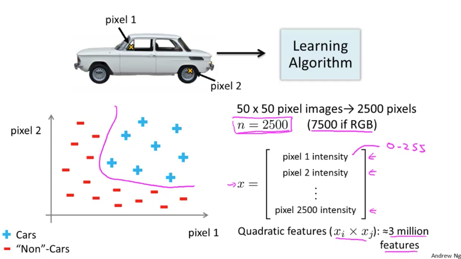
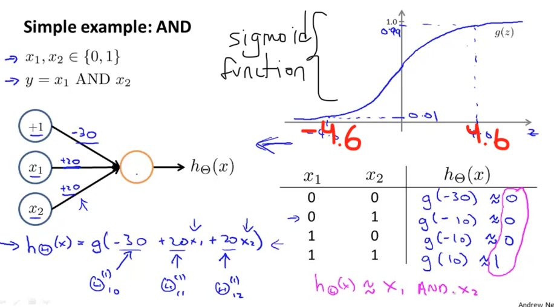

# Neural Networks: Representation

## Motivations

### Non-linear Hypotheses

In order for a computer to recognize a car, it would need some pixels (in this case just 2) and then plot the locations of those pixels. The intersting thing here is that if we do the same thing for more examples we'll find that the cars and non-cars end up lying in different regions of the space and we therefore would need some sort of **non-linear hypotheses** to try to separate out the two classes. 

### Neurons and the Brain

Neural Networks are a pretty old algorithm that was originally motivated by the goal of having machines that can mimic the brain. Nowadays Neural Networks are resurging due to the fact that we needed powerful computers that in the 80's and 90's we didn't had. Finally, there is a sense that if we can figure out what the brain's learning algorithm is and make a good approximation on a computer then we can dream of someday building truly intelligente machines. 

## Neural Networks

### Model Representation I

The idea is to understand how to represent a neural network. Neural networks were developed as simulating neurons or networs of neurons in the brain. Basically a neuron has input wires called dendrites which receive inputs from other neurons. It has a body that process the information and an output wire that is used to send signals to other neurons. 

> A neuron is a computational unit that gets a number of inputs through its input wires and does some computation and then it sends outputs via its axon to other nodes or other neurons in the brain. 

> A neural network is just a group of this different neurons combined together. 

### Model Representation II

The process of computing $x$ is called **forward propagation** and it's called that way because we start with the activations of the input units and we *forward-propagate* that to the hidden layer and computer the activations of that hidden layer to then *forward-propagate* that and compute the activations of the output layer. 

Neural Network:

​	$a_1^{(2)} = g(\Theta_{10}^{(1)}x_0 + \Theta_{11}^{(1)}x_1 + \Theta_{12}^{(1)}x_2) + \Theta_{13}^{(1)}x_3)$

​	$a_2^{(2)} = g(\Theta_{20}^{(1)}x_0 + \Theta_{21}^{(1)}x_1 + \Theta_{22}^{(1)}x_2) + \Theta_{23}^{(1)}x_3)$

​	$a_3^{(2)} = g(\Theta_{30}^{(1)}x_0 + \Theta_{31}^{(1)}x_1 + \Theta_{32}^{(1)}x_2) + \Theta_{33}^{(1)}x_3)$

​	$h_\Theta(x) = a_1^{(3)} = g(\Theta^{(2)}_{10}a_0^{(2)} + \Theta^{(2)}_{11}a_1^{(2)} + \Theta^{(2)}_{12}a_2^{(2)} + \Theta^{(2)}_{13}a_3^{(2)})$

To do the vectorized implementation of the above functions we are going to define a new variable $z_k^{(j)}$ that encompasses the parametes inside of our $g$ function. 

​	$a_1^{(2)} = g(z_1^{(2)})$

​	$a_2^{(2)} = g(z_2^{(2)})$

​	$a_3^{(2)} = g(z_3^{(2)})$

For layer $j=2$ and node $k$, the variable $z$ will be: 

​	$z_k^{(2)} = \Theta_{k,0}^{(1)}x_0 + \Theta_{k,1}^{(1)}x_1 + ... + \Theta_{k,n}^{(1)}x_n$

The vector representation of $x$ and $z^j$ is: 

​	$x = \begin{bmatrix} x_0\\x_1\\...\\x_n\end{bmatrix}$ 	$z = \begin{bmatrix} z_1^{(j)}\\z_2^{(j)}\\...\\z_n^{(j)}\end{bmatrix}$

Setting $x=a^{(1)}$, we can rewrite the equation as: 

​	$z^{(j)} = \Theta^{(j-1)}a^{(j-1)}$

Matrix $\Theta^{(j-1)}$ has dimensions $s_j$ x $(n+1)$ where $s_j$ is the number of our activation nodes. Matrix $a^{(j-1)}$ has dimensions $(n+1)$ which results in a vector $z^{(j)}$ with height $s_j$. Now we can get a vector for our activation nodes for layer $j$ as follows: 

$a^{(j)} = g(z^{(j)})$ 

Our final result is...

$h_\Theta(x)=a^{(j+1)}=g(z^{(j+1)})$

## Applications

### Examples and Intuitions I

### Examples and Intutions II

ANDNOT(X2).png)

