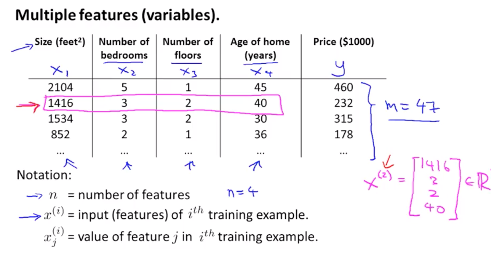

### Week 2 

#### Linear Regression with Multiple Variables 

New hypothesis: 

$h_\Theta(x) = \Theta_0X_0 + \Theta_1X_1 + ... + \Theta_nX_n$ -> Multivariate linear regression 

$x_0 = 1$ 

$h_\Theta(x) = \Theta^Tx$ 

---

#### Gradient Descent for Multiple Variables 

----

#### Gradient Descent in Practice: Feature Scaling 

We divide our features values so that Gradient Descent takes less time to approach the center of our function. 

We need to get every feature intro approximately $-1 <= x_i <= 1$

**Mean Normalization**

Replace $x_i$ with $x_i - \mu_i$ to make features approximately zero to mean. 

$\mu_i$: average value of $x_i$ in training set 

$s_i$: range (max-min) or standard deviation 

$x_i = \frac{x_i - \mu_i}{s_i}$

----

#### Gradient Descent in Practice: Learning Rate 

1. How to know if G.D. is working correctly? 
2. How to get a proper value of $\alpha$

$J(\Theta)$ should decrease after each iteration 

**When** G.D. is NOT working 

**Notes:** 

1. If $\alpha$ is small enough $J(\Theta)$ should decrease but it may do it very slowly. 
2. if $\alpha$ is too big $J(\Theta)$ may not decrease on every iteration; may not converge. 

**To Choose $\alpha$** try:  ..., 0.001, 0.003, 0.01, 0.03, 0.1, 0.3, 1, ...

---

#### Features and Polynomial Regressions 

We can create our own features besides the ones that are given to us; depending on the insight we have of our problem. 

**Polynomial Regression**

How do we fit one model to our data ?? For example, using a cubic model 

Now, we should use **Feature Scaling**

#### Choice of Features

