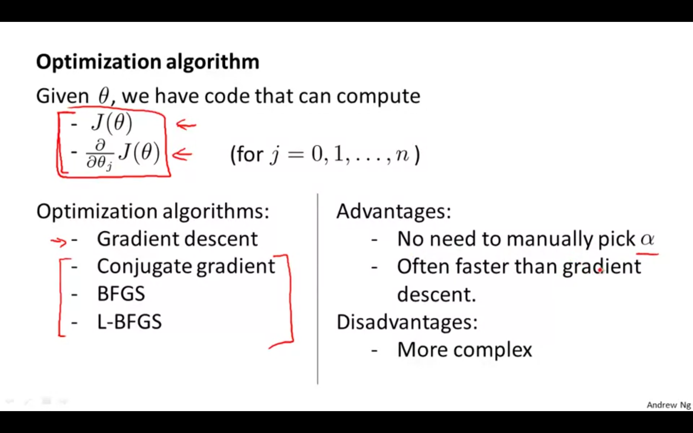
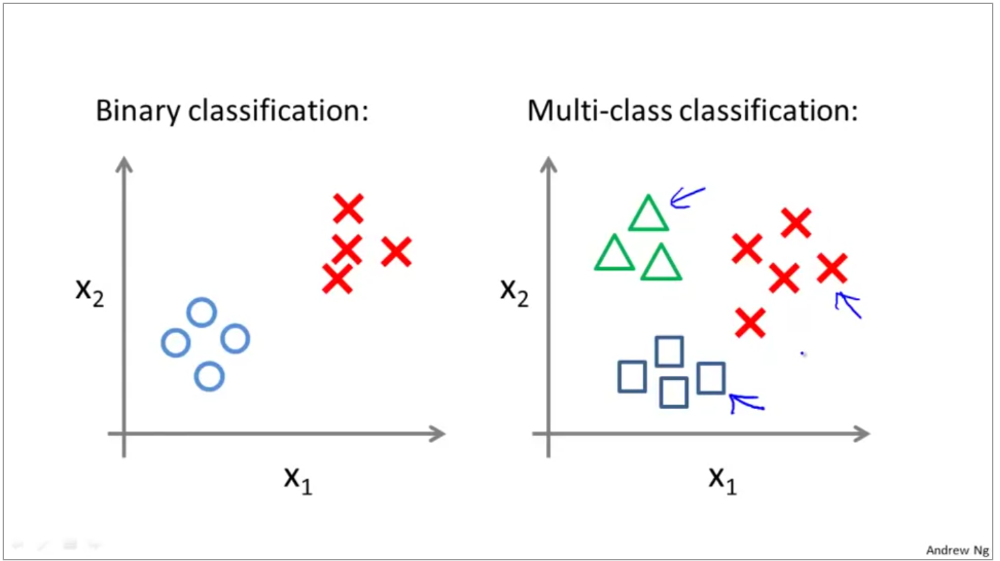
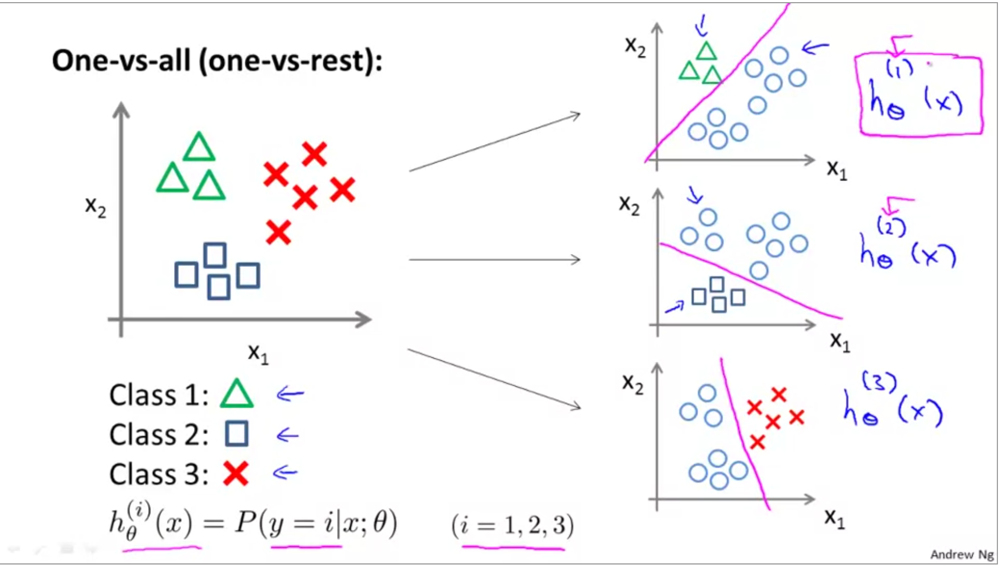
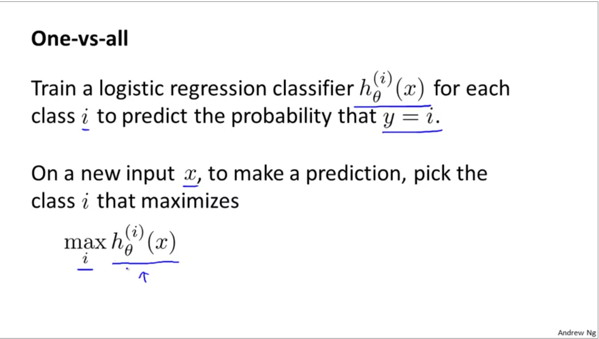
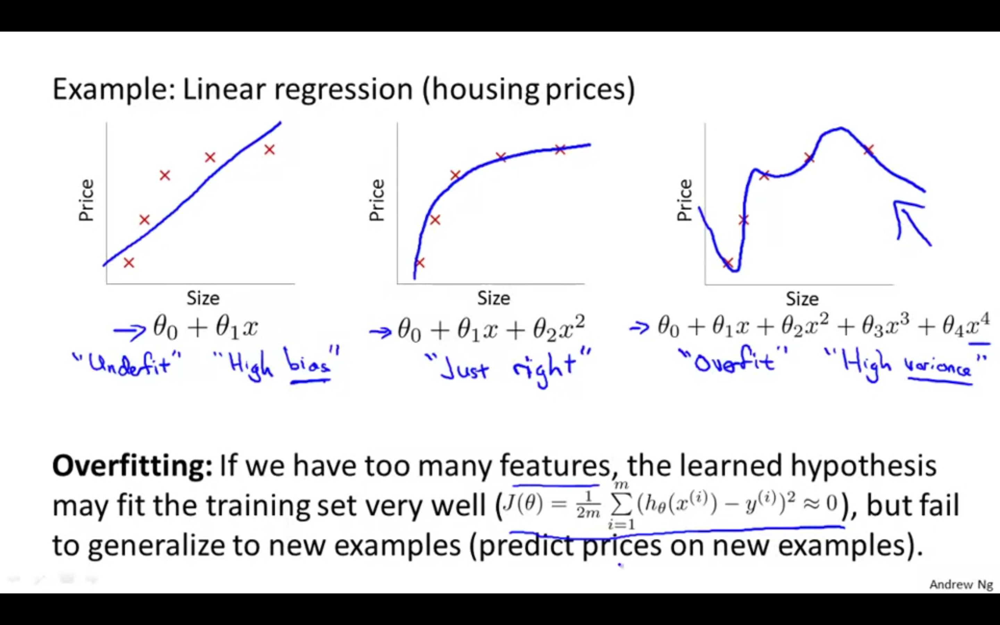
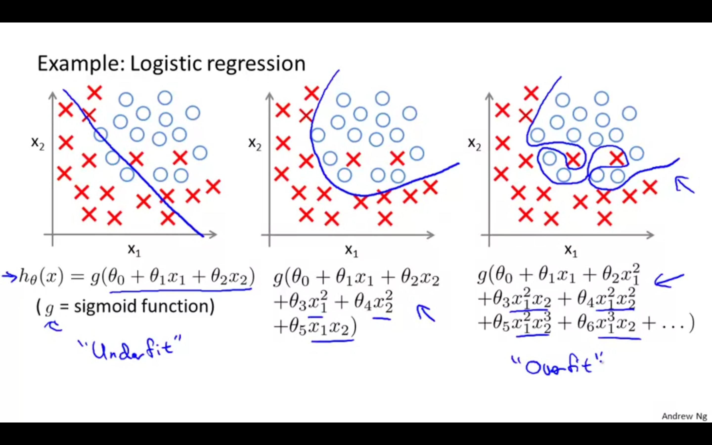

### Week 3

---

### Logistic Regression: Classification 

Examples: 

- Email: Spam, not Spam? 
- Online Transactions: Fraudalent (y/n) ? 
- Tumor: Malignant/Benign ? 

The variable $y$ is a discrete variable between $0$ and $1$. 

- 0: Negative class 
- 1: Positive class 

Multiclass classification problem: $y$ can be $0,1,2,3,4$ instead of $0$ or $1$. 

---

<u>Note:</u> do not use linear regression for classification problems. 

**Logistic Regression algorithm:** $0 <= h_\Theta <= 1$

####Hypothesis Representation

---

#### Decision Boundary 

$h_\Theta = g(\Theta^Tx) = P(y=1|x;\Theta)$

$g(z) = \frac{1}{1+e^z}$

---

#### Non-linear decision boundaries 

 

<u>Note:</u> $\Theta$ is the vector that defines the decision boundary and NOT the training examples. 

---

#### Cost Function

How can we fit the parameters $\Theta$ to our data? 

**Logistic regression cost function**

We cannot use the same cost function that we use for linear regression because the Logistic Function will cause the output to be wrong, causing many local optima (i.e., it will not be a convex function). 

**Cost function for logistic regression...**

$J_\Theta = \frac{1}{m}\Sigma Cost(h_\Theta(x^{(i)}),y^{(i)})$

$Cost(h_\Theta(x),y) = -log(h_\Theta(x))$ if $y=1$

$Cost(h_\Theta(x),y) = -log(1-h_\Theta(x))$ if $y=0$

<u>Note:</u> we write the cost function this way to guarantee that the cost function is convex for logistic regression. 

---

#### Simplified cost funcition and gradient descent 

$Cost(h_\Theta,y) = -y log(h_\Theta(x)) - (1-y)log(1-h_\Theta(x))$; $y=1$ or $y=0$ --> Simplified cost function

**Gradient Descent**

 

---

#### Advanced optimization 

The idea is to minimize $J_\Theta$ 

---

### Multi-class Classification 

#### One vs All 

Email foldering / tagging = Work, Friends, Hobbies, Family 

Medical diagrams: Not ill, Cold, Flu 

Weather: Sunny, Cloudy, Rain, Snow 

$y = {0,1,2,3}$

We run all three of our classifiers on the input x and we pick the class that maximizes the value of our function $h_\Theta$ and we then predict $y$ to be that value. 

---

### Regularization 

Regularization will allow us to deal with the problem of *overfitting* which can be a consequence of linear and logistic regression. 

#### The problem of overfitting 

If we encounter a problem of overfitting, it means that the hypothesis function has fit the data so well that when it encounters more training examples (i.e. new data) it fails to adapt. In other words, the learned hypothesis fails to generalize to new training examples. 

**Underfitting**, or high bias, is when the form of our hypothesis function h maps poorly to the trend of the data. It is usually caused by a function that is too simple or uses too few features.

At the other extreme, **overfitting**, or high variance, is caused by a hypothesis function that fits the available data but does not generalize well to predict new data. It is usually caused by a complicated function that creates a lot of unnecessary curves and angles unrelated to the data.

---

#### Adressing overfitting: 

How to solve it? 

1. Reduce the number of features. 

   1. Manually select which features to remove. 
   2. Model selection algorithm. 

2. Regularization. 

   - Here we keep all the features but reduce the magnitude/values of $\Theta_j$

   - Works well when we have a lot of features, each one contributing to predicting the value of $y$. 

