### Week 3

---

### Logistic Regression: Classification 

Examples: 

- Email: Spam, not Spam? 
- Online Transactions: Fraudalent (y/n) ? 
- Tumor: Malignant/Benign ? 

The variable $y$ is a discrete variable between $0$ and $1$. 

- 0: Negative class 
- 1: Positive class 

Multiclass classification problem: $y$ can be $0,1,2,3,4$ instead of $0$ or $1$. 

---

<u>Note:</u> do not use linear regression for classification problems. 

**Logistic Regression algorithm:** $0 <= h_\Theta <= 1$

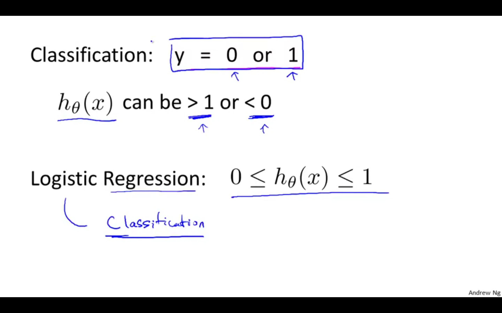

####Hypothesis Representation

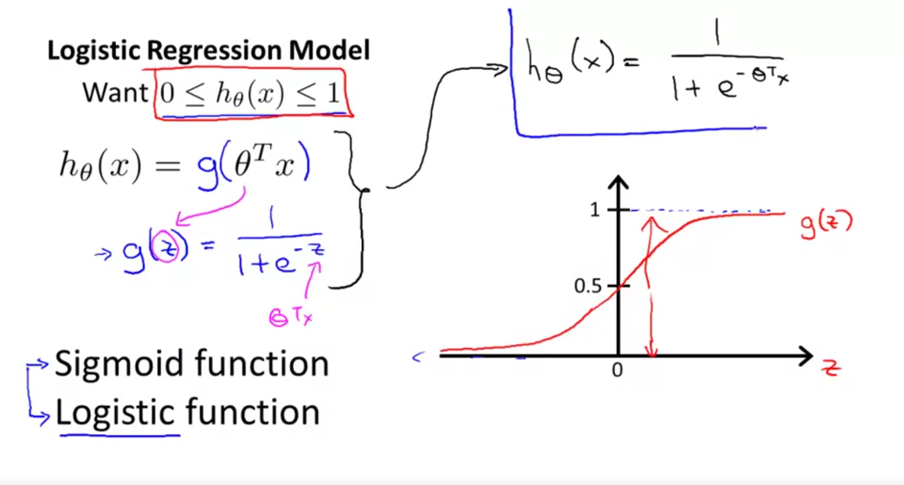

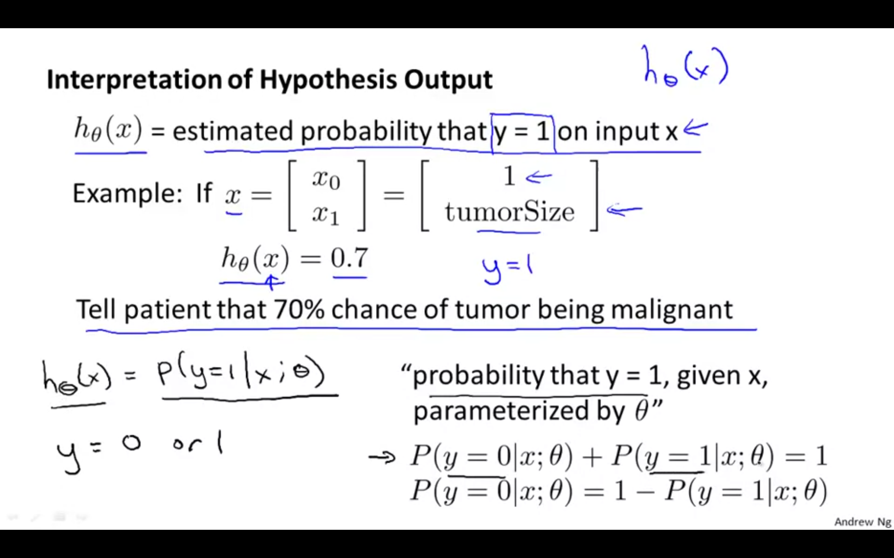

---

#### Decision Boundary 

$h_\Theta = g(\Theta^Tx) = P(y=1|x;\Theta)$

$g(z) = \frac{1}{1+e^z}$

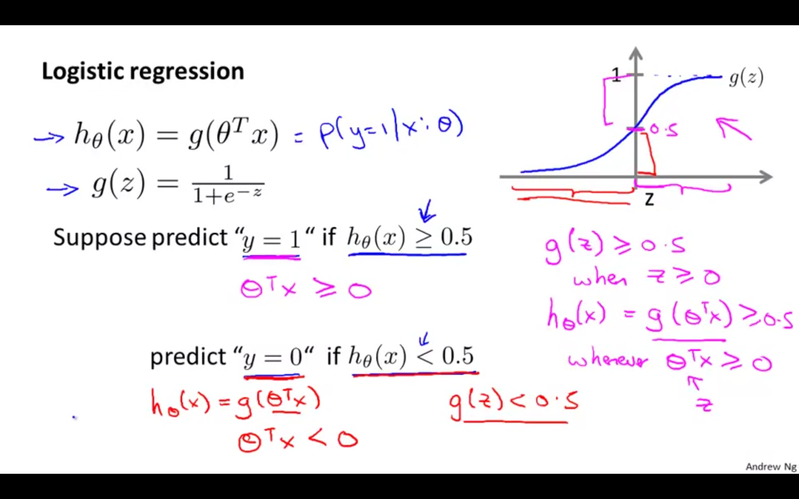

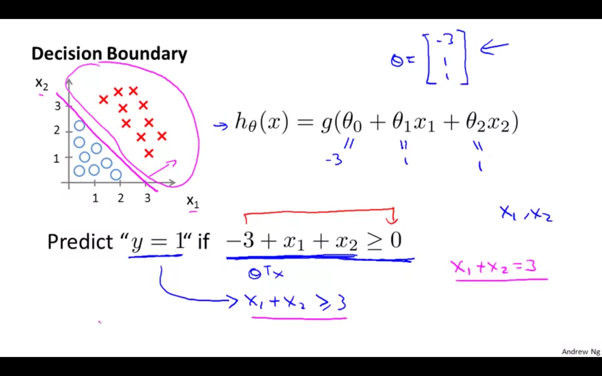

---

#### Non-linear decision boundaries 

 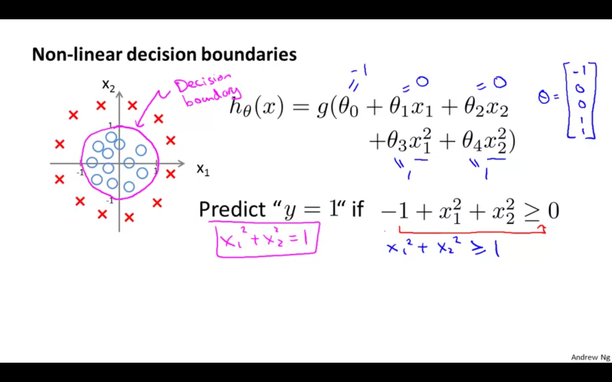

<u>Note:</u> $\Theta$ is the vector that defines the decision boundary and NOT the training examples. 

---

#### Cost Function

How can we fit the parameters $\Theta$ to our data? 

**Logistic regression cost function**

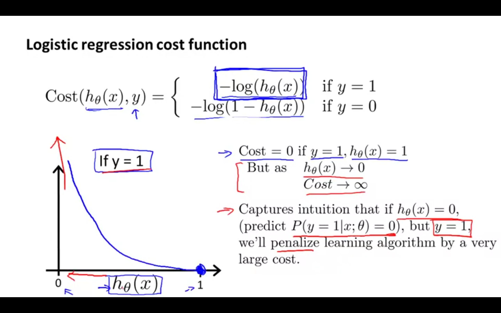

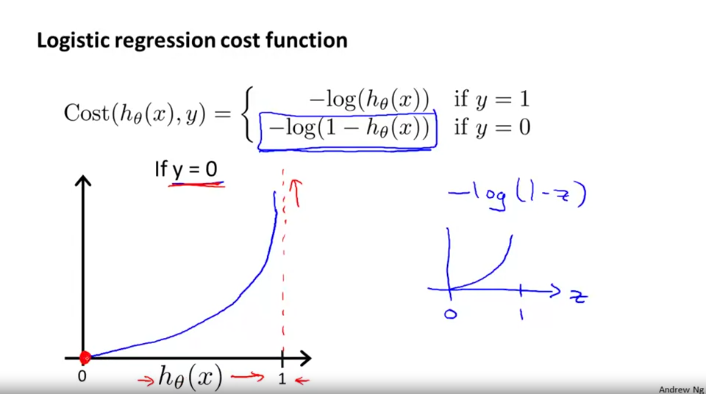

We cannot use the same cost function that we use for linear regression because the Logistic Function will cause the output to be wrong, causing many local optima (i.e., it will not be a convex function). 

**Cost function for logistic regression...**

$J_\Theta = \frac{1}{m}\Sigma Cost(h_\Theta(x^{(i)}),y^{(i)})$

$Cost(h_\Theta(x),y) = -log(h_\Theta(x))$ if $y=1$

$Cost(h_\Theta(x),y) = -log(1-h_\Theta(x))$ if $y=0$

<u>Note:</u> we write the cost function this way to guarantee that the cost function is convex for logistic regression. 

---

#### Simplified cost funcition and gradient descent 

$Cost(h_\Theta,y) = -y log(h_\Theta(x)) - (1-y)log(1-h_\Theta(x))$; $y=1$ or $y=0$ --> Simplified cost function

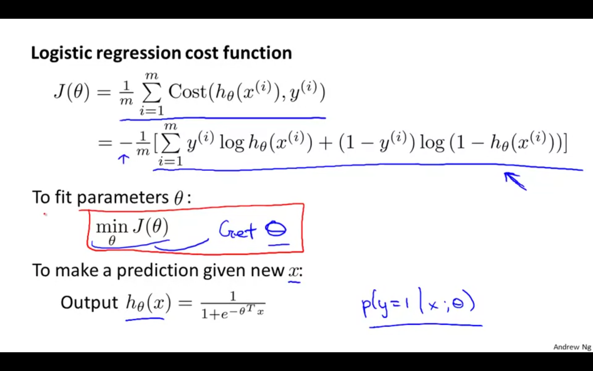

**Gradient Descent**

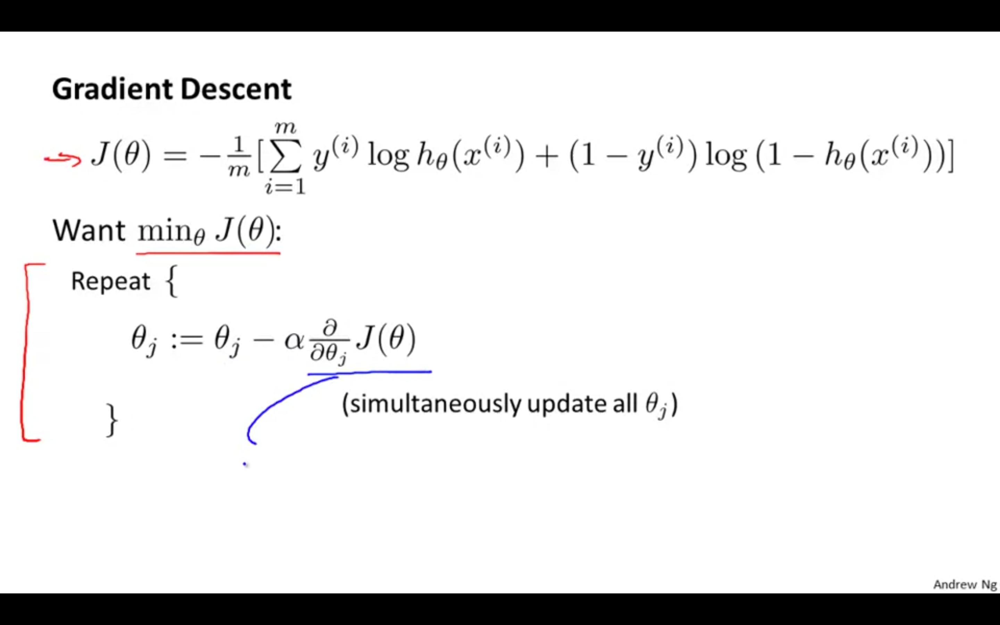

 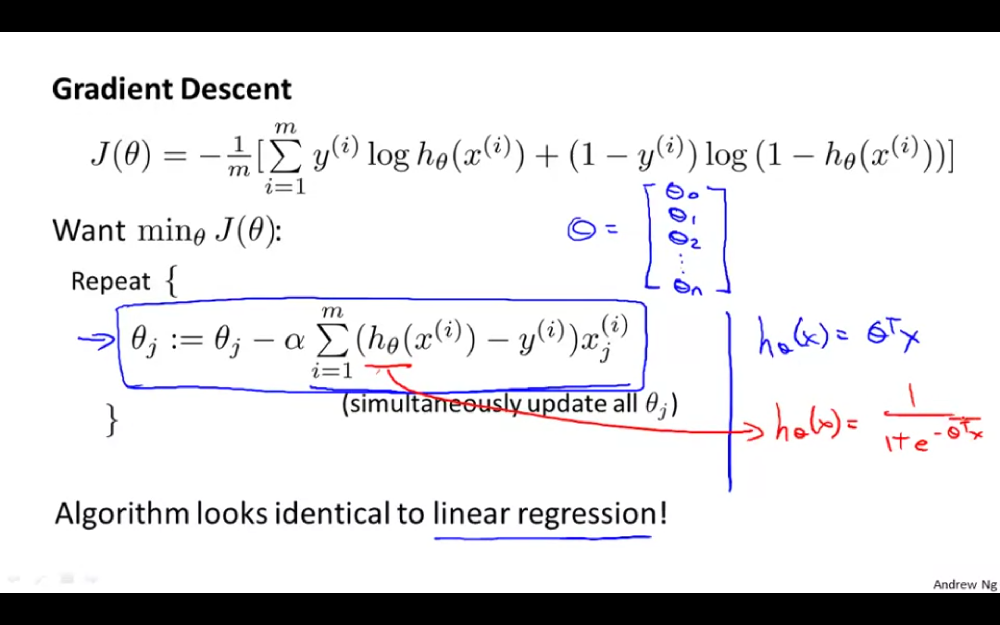

